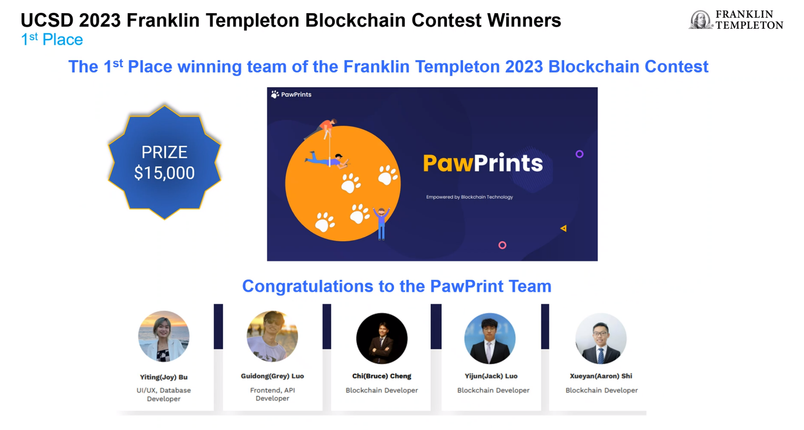

# Congratulations

# Getting Started with PawPrints

PawPrints is a blockchain-powered platform for pet medical data tracking and sharing. It connects pet owners, clinics, and insurance companies, providing a seamless interface for managing pet medical data. This guide will take you through setting up PawPrints for development on your local machine.

## Prerequisites

Before you begin, ensure you have met the following requirements:

You have a recent version of Node.js and npm installed.
You also need to have MySQL server installed (You may want to set up tables for users, pets, and medical_records and change to configuration in server.js  to run it)

## Installation

### Frontend

Navigate to the frontend project directory and run:

### `npm install`

This will install all the necessary dependencies for the frontend.

### Backend API

Similarly, navigate to the backend project directory and run:

### `npm install`

This will install all the necessary dependencies for the backend.

## Usage

### Frontend

To start the development server, run:

### `npm start`

This will run the app in development mode. Open http://localhost:3000 to view it in your browser. The page will reload when you make edits.

To build the app for production, run:

### `npm run build`

This command builds the app for production to the build folder. It correctly bundles React in production mode and optimizes the build for the best performance.

### Backend API

To start the API server, run:
### `node server.js`

You should be able to see "API is running on http://localhost:8080"

### Backtend

To start, we run on a blockchain integrated IDE, called Remix

## TroubleShooting

If you run into issues with missing dependencies, the error messages should indicate which dependencies are missing. You can install them using npm:

### `npm install missing-dependency-name`
